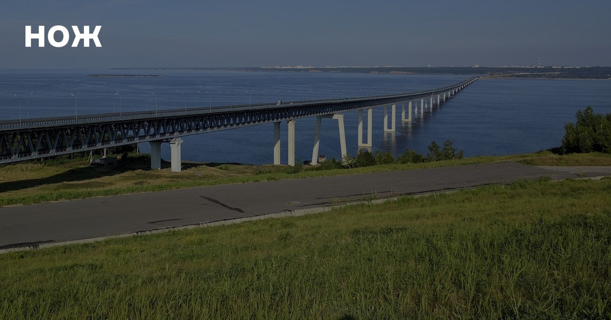
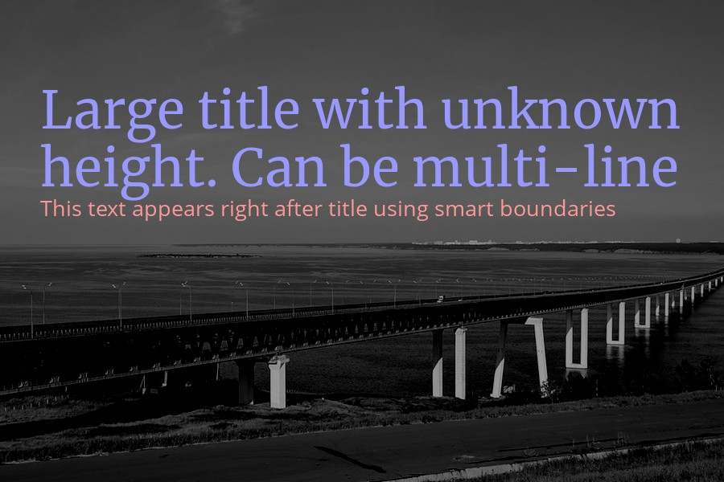

# Poster Editor

This class is an alternative to the package [Intervention Image](https://github.com/Intervention/image) for more flexible work with text on the image.
Use it if you need to **fit text** in a given area, automatically **calculate font size** and change **line height**. 
The text drawing method also knows how to return the actual size of the inscriptions, which will allow, for example, to place blocks under each other.

In addition to flexible work with text, the class provides an Image API similar to the Intervention package. 
Including smart poster resizing, filters, drawing shapes, and overlaying other images.

If you are not using composer in your work, you may also be interested in the simplicity of the class and the absence of any dependencies.
Note that this class supports PHP-GD driver only.
You can also easily inherit your class — all methods of the parent can be overridden.

## Installation
The best way to install Poster Editor is quickly and easily with [Composer](http://getcomposer.org/).  
However, you can require the class directly without using a loader - this will not affect performance in any way.

`php composer.phar require antonlukin/poster-editor`

## Usage
In case of an error, the class methods return an exception.  
Therefore, it is best to call them inside a block `try..catch`.

#### Example
```php
// Using composer
require_once __DIR__ . '/vendor/autoload.php';

// Or directly
// require_once __DIR__ . '/PosterEditor.php';

try {
    $image = new PosterEditor\PosterEditor();
    $image->make('images/bridge.jpg')->fit(600, 600);
    $image->show();

} catch(Exception $e) {
    echo $e->getMessage();
}
```

## Availible methods
### get
```
$image->get()
```
Get image resource to use raw gd commands.

### set
```
$image->set(instance $resourse)
```
Set image resource after using raw gd commands.

### make
```
$image->make(mixed $data)
```
Make new image instance from file or binary data.

### insert
```
$image->insert(mixed $data, array $options = array())
```
Paste a given image source over the current image with an optional position. 
First param can be binary data or path to file or another class instance.
Options is an array of x/y relative offset coords from top left corner. By default image will be centered.

### canvas
```
$image->canvas(int $width, int $height, array $options = array())
```
Intialise the canvas by width and height. Background color options is in array of color/opacity settings.
By default black canvas.

### show
```
$image->show(string $format = null, int $quality = 90)
```
Sends HTTP response with current image in given format and quality.
Format is a file image extension. By default the response data will be encoded in the type of the current image. If no image type is defined yet, method will return jpeg encoded data.
Quality is normalized for all file types to a range from 0 (poor quality, small file) to 100 (best quality, big file). 
The default value is 90. PNG format is losless and the quality affects only image size and compression speed.

### save
```
$image->save(string $path, int $quality = 90, string $format = null)
```
Save the current state of the image object in filesystem. Define optionally a certain path where the image should be saved. The image type will be defined by file extension. If there is no extension available, the response data will be encoded in the type of the current image. If no image type is defined yet, method will return jpeg encoded data. Optionally you can override this with the format parameter. 
Quality is normalized for all file types to a range from 0 (poor quality, small file) to 100 (best quality, big file). 
The default value is 90. PNG format is losless and the quality affects only image size and compression speed.

### destroy
```
$image->destroy()
```
Frees memory associated with the current image instance before the PHP script ends. 
Normally resources are destroyed automatically after the script is finished.

### width
```
$image->width()
```
Returns the height in pixels of the current image.

### height
```
$image->height()
```
Returns the height in pixels of the current image.

### resize
```
$image->resize(int $width, int $height)
```
Resizes current image based on given width and height. 
Does not pay attention to the aspect ratio. In order to resize proportionally, use `upsize` and `downsize` methods.

### upsize
```
$image->upsize(int $width = null, int $height = null)
```
Upsize image on the largest side. Calculated by ratio for nulled width or height.

### downsize
```
$image->downsize(int $width = null, int $height = null)
```
Downsize image on the largest side. Calculated by ratio for nulled width or height.

### crop
```
$image->crop(int $width, int $height, array $options = array())
```
Cut out a rectangular part of the current image with given width and height.
Define optional x,y coordinates to move the top-left corner of the cutout to a certain position.

### fit
```
$image->fit(int $width, int $height, string $position = 'center')
```
Combine cropping and resizing to format image in a smart way.
The method will find the best fitting aspect ratio on the current image automatically, 
cut it out and resize it to the given dimension. 
Possible positions `top-left`, `top`, `top-right`, `bottom-left`, `bottom`, `bottom-right`, `right`, `left` and `center` by default.

### line
```
$image->line(int $x1, int $y1, int $x2, int $y2, array $options = array())
```
Draw a line from x,y point 1 to x,y point 2 on current image. Use options param to set color, opacity and width values.

### rectangle
```
$image->rectangle(int $x, int $y, int $width, int $height, array $options = array())
```
Draw a colored rectangle on current image. Use options param to set color, opacity, thickness and outline values.

### ellipse
```
$image->ellipse(int $x, int $y, int $width, int $height, array $options = array())
```
Draw an ellipse. Use options param to set color, opacity and outline values.

### brightness
```
$image->brightness(int $level = 0)
```
Change the brightness of the current image by the given level.
Use values between -100 for min brightness 0 for no change and +100 for max.

### contrast
```
$image->contrast(int $level = 0)
```
Change the contrast of the current image by the given level.
Use values between -100 for min contrast 0 for no change and +100 for max.

### grayscale
```
$image->grayscale()
```
Turn an image into a grayscale version.

### blur
```
$image->blur()
```
Apply a blur image effect.

### invert
```
$image->invert()
```
Invert colors of an image.

### blackout
```
$image->blackout()
```
Draw black opactity rectangle on image.

### rotate
```
$image->rotate(int $angle, array $options = array())
```
Rotate image. Set an angle in degrees and optional color of the uncovered zone after the rotation.

### text
```
$image->text(string $text, array $options = array(), array &$boundary = array())
```
Draw text on image. Look for all possible options in the examples below.

## Examples

### Append downsized image to blackout background
```php
$image = new PosterEditor\PosterEditor();
$image->make('images/bridge.jpg')->fit(1200, 630, 'bottom')->blackout(50);

$logo = new PosterEditor\PosterEditor();
$logo->make('images/logo.png')->downsize(150, null);

$image->insert($logo, array('x' => 50, 'y' => 50))->show();
```
#### Result


### Draw and center multiline text
```php
$image = new PosterEditor\PosterEditor();
$image->make('images/bridge.jpg')->fit(1200, 630);
$image->grayscale()->brightness(-40);

$image->text(
    'Lorem ipsum dolor sit amet, consectetur adipiscing elit, sed do eiusmod tempor incididunt ut labore et dolore magna aliqua. Ut enim ad minim veniam, quis nostrud exercitation ullamco laboris nisi ut aliquip ex ea commodo consequat Lorem ipsum dolor sit amet', // phpcs:ignore
    array(
        'x'          => 100,
        'y'          => 100,
        'width'      => 1000,                 // Use image width if null or unset
        'height'     => 400,                  // Use image height if null or unset
        'horizontal' => 'center',             // Can be left/right/center
        'vertical'   => 'center',             // Can be top/center/bottom
        'fontpath'   => 'fonts/opensans.ttf', // Can only be .ttf
        'fontsize'   => 24,
        'lineheight' => 1.75,
        'color'      => '#ffffff',
        'opacity'    => 1,
        'debug'      => true,
    )
);

$image->show('jpg', 70);
```
#### Result


### Use boundaries to draw one title right after another
```php
$image = new PosterEditor\PosterEditor();
$image->make('images/bridge.jpg')->crop(
    900, 600,
    array(
        'x' => '0',
        'y' => '100'
    )
);

$image->grayscale()->brightness(-40);

$image->text(
    'Large title with unknown height. Can be multi-line',
    array(
        'x'          => 50,
        'y'          => 100,
        'width'      => 800,
        'fontpath'   => '/fonts/merriweather.ttf',
        'fontsize'   => 48,
        'lineheight' => 1.5,
        'color'      => '#9999ff',
    ),
    $boundary
);

$image->text(
    'This text appears right after title using smart boundaries',
    array(
        'x'          => 50,
        'y'          => 100 + $boundary['height'],
        'width'      => 800,
        'fontpath'   => '/fonts/opensans.ttf',
        'fontsize'   => 20,
        'lineheight' => 1.5,
        'color'      => '#ff9999',
    ),
    $boundary
);

$image->show();
```
#### Result


### Draw shapes
```php
$image = new PosterEditor\PosterEditor();
$image->make('images/bridge.jpg')->fit(1000, 630, 'bottom');
$image->contrast(5)->brightness(-30)->blur();

$image->rectangle(
    20, 20, 960, 590,
    array(
        'color'   => '#ffffff',
        'outline' => true,
        'width'   => 4,
    )
);

$image->ellipse(
    200, 200, 200, 200,
    array(
        'color'   => '#00ff00',
        'opacity' => 50,
    )
);

$image->ellipse(
    800, 200, 200, 200,
    array(
        'color'   => '#ff0000',
        'opacity' => 50,
    )
);

$image->rectangle(
    480, 280, 80, 140,
    array(
        'color'   => '#0000ff',
    )
);

$image->line(
    200, 500, 800, 500,
    array(
        'color'   => array(255, 255, 0),
        'opacity' => 10,
        'width'   => 4,
    )
);

$image->show('png');
```
#### Result


## Contribution
All project code is stored on Github. The best way to help the project is to report a bug or add some new functionality. 
You can also open here an [issue](https://github.com/antonlukin/poster-editor/issues) or send a [pull reguest](https://github.com/antonlukin/poster-editor/pulls).